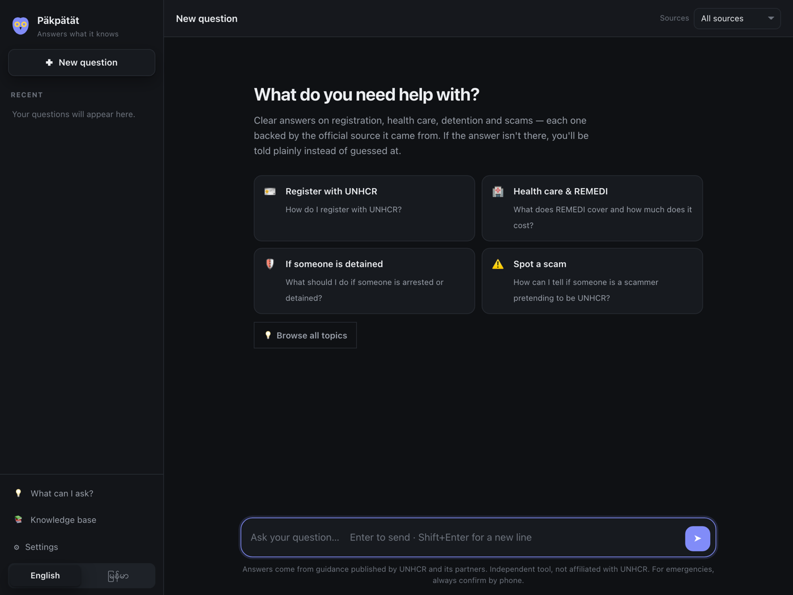
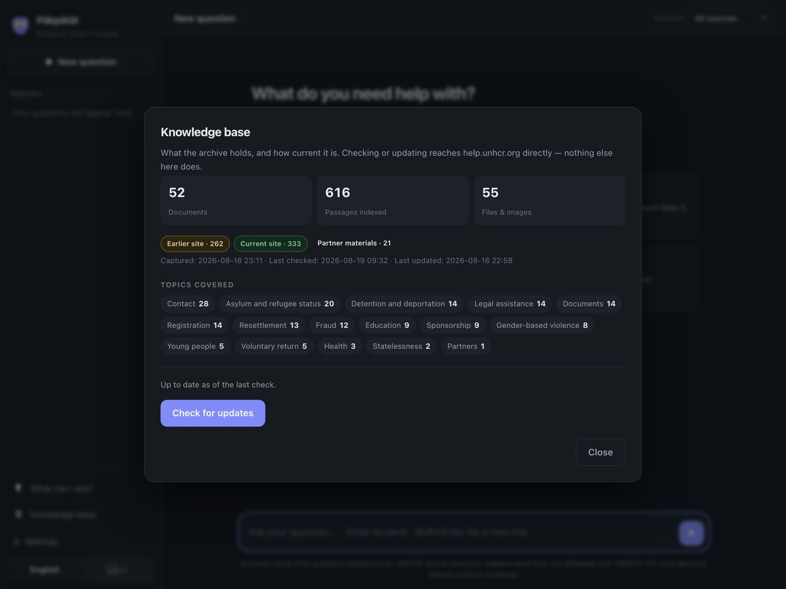
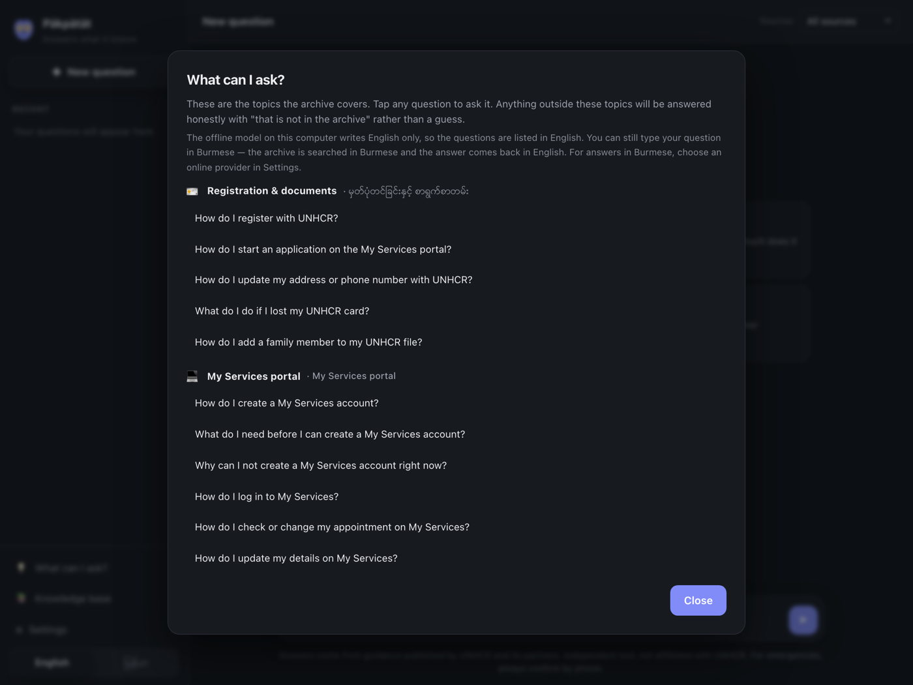

# Päkpätät


**It answers what it knows. It says so when it doesn't.**

K'Cho *`päkpätät`*: **owl** — the one who is asked, and who answers.

Päkpätät answers questions from an archive of refugee-support guidance. It
runs entirely on one laptop, with no internet and no API key, and it is built
around a single rule: **it would rather say "that is not in the archive" than
guess.**

Every answer cites the pages it came from. Every citation is checked in code.
Every phone number, fee and date is checked against the source text before the
answer is shown.

> This project is **not affiliated with UNHCR** and ships **no archive content**.
> See [NOTICE.md](NOTICE.md).



## What it knows

A reference operator's archive currently indexes:

| | |
|---|---|
| **616** searchable passages | across **86** documents and **80** topics |
| **73,409** words of guidance | held offline, on one laptop |
| **333** passages | from the live **help.unhcr.org/malaysia** site |
| **262** passages | from the retired **refugeemalaysia.org** capture — guidance taken offline on 2026-07-14, including topics the new site never carried |
| **21** passages | from partner briefings given directly to the operating organisation |
| **49** suggested questions | in **11** categories, English and Burmese — every one verified against the retriever before it was added |

These counts describe one organisation's archive. The software ships with none
of it — see [What is in this repository](#what-is-in-this-repository--and-what-is-not).

## Credits and sources

The guidance this tool retrieves is **not its own work**. It belongs to the
organisations that wrote it:

- **UNHCR Malaysia** — [help.unhcr.org/malaysia](https://help.unhcr.org/malaysia),
  the current official source of refugee guidance in Malaysia, and the page
  every answer links back to for verification. Text and guidance © UNHCR.
- **refugeemalaysia.org** — UNHCR Malaysia's previous site, retired on
  **14 July 2026**. Much of what it held was never migrated. It is preserved
  here, clearly labelled as retired, because the information did not stop being
  needed when the website stopped being served.
- **Allianz Malaysia**, with UNHCR, for the REMEDI refugee medical insurance
  programme and the partner briefings that keep its terms current.
- The **community-based organisations** and community leaders who attend those
  briefings and carry the guidance to the people who need it.

Answers cite their source and link back to UNHCR wherever a live page exists.
Nothing here is presented as UNHCR's own service, and no UNHCR branding is used.
Where this archive and the live site disagree, the app says so rather than
choosing silently.

**Software:** MIT-licensed open source, built by **Hung Om**. The code is free
to fork and run; the archive content is not covered by that licence and is not
distributed — see [NOTICE.md](NOTICE.md).

---

## Why it exists

A case worker at a community organisation is asked forty questions a day —
*where can my child go to school, what does the insurance cover, who do I call
if my brother has been detained* — and the answers sit scattered across
hundreds of pages, some of which have been taken offline.

A general-purpose chatbot will answer all forty confidently, and invent a
hotline number for at least one of them. In this domain a wrong phone number is
not an inconvenience; it is a person calling a stranger in an emergency.

So Päkpätät is a graph, not a prompt. Three of its four safety layers are
plain code that the model cannot talk its way past.

## How it works

```
retrieve ──▶ guard ──┬──▶ generate ──▶ verify ──▶ answer
                     └──▶ refuse
```

1. **Refusal gate** (code, before generation) — if nothing retrieved is
   relevant enough, the model is never called. A model that is never asked
   cannot invent an answer.
2. **Grounding** (prompt) — the model sees only retrieved archive text, and is
   told to answer solely from it and cite `[S1]`, `[S2]` for every claim.
3. **Citation verification** (code, after generation) — every `[S#]` is checked
   against what was actually retrieved. Invented citations are stripped and the
   answer is flagged.
4. **Fact verification** (code, after generation) — every phone number, email,
   fee and date in the answer must appear verbatim in the sources. A correctly
   cited hotline with one digit changed is the most dangerous output this
   system can produce, and this is the only layer that catches it.

Retrieval is hybrid and fully offline: a multilingual ONNX embedding model for
meaning, BM25 for exact tokens (hotline numbers, "REMEDI", clinic names),
combined with Reciprocal Rank Fusion.

## Measured behaviour

Retrieval is held to a gold set of real questions paired with the exact fact
each must surface — because if the fact never reaches the model, no amount of
prompting saves the answer.

| | |
|---|---|
| recall@8 on the gold set | **90%** (9/10) |
| prompt size | mean 2,951 tokens, max 4,588 |
| retrieval latency | ~11 ms warm (dense 0.2 ms, BM25 0.8 ms) |
| answer latency | 5–11 s on an Apple M1, local 3B model |

```bash
python eval/eval_retrieval.py                          # run the gold set
python eval/eval_retrieval.py --save eval/baseline.json
python eval/eval_retrieval.py --compare eval/baseline.json   # exits 1 on regression
```

**Run this before and after any change to chunking, embeddings, fusion or
`TOP_K`.** It has already caught a change that looked like a clear improvement
— smaller prompts, better semantic ranking — but silently dropped recall from
90% to 80%.

One gold case is knowingly failing: a Burmese question for the registration
hotline retrieves the right *topic* pages but not the page holding the number.
It is left visible rather than quietly removed. See the notes in
`pakpatat/retrieve.py`.

---

## What is in this repository — and what is not

This matters before you clone, fork or publish anything built on it.

**Ships:** the retrieval and answering pipeline, the corpus builder, the
refresh pipeline, the evaluation harness, the desktop app, and the MCP server.
Code only. **MIT licensed.**

**The repository itself never touches UNHCR.** Cloning and building — including
the release workflows — fetch nothing from `help.unhcr.org`; the only download
in a build is the embedding model.

An *installed* copy can fetch, and only when someone asks it to: the Knowledge
base panel crawls the site from a button, politely and rate-limited
([NOTICE.md](NOTICE.md) lists what is enforced and every route that can start
one). There is no fetch on launch and no background check. That is how a fresh
install gets something to search — it is not the same thing as this repository
carrying UNHCR's content, and it does not make redistributing what you fetched
your decision to make.

**Deliberately absent, and git-ignored:**

| | why |
|---|---|
| `data/` — corpus, index, manifests, refresh state | The source material is **© UNHCR**. Publishing it is UNHCR's decision, not ours. [NOTICE.md](NOTICE.md) |
| `.env` — API keys | Written by the in-app Settings panel, `chmod 600`, never committed |
| Any UNHCR page, PDF, deck, poster or photograph | Same as above |
| Any personal data | The corpus is built from published organisational contact details only. Do not extend it with case files, client records or registration numbers — nothing here is designed or audited for that, and the desktop app stores conversation history in plain `localStorage` |

The `.gitignore` enforces the first two before anything else in the file, and
the git history contains no `.env`, no `*.jsonl` and no archive content.

**If you fork this, you are forking an empty shelf** — one that knows how to
fill itself from `help.unhcr.org`, and nothing more. You still supply your own
archive for anything beyond the live site. Read [NOTICE.md](NOTICE.md) before
pointing it at someone else's site, keep the rate limiting and `robots.txt`
handling in `pakpatat/scrape.py` intact if you do, and do not reintroduce
UNHCR's name, logo or brand blue as if this were an official service — an
earlier working title did exactly that and was dropped for it.

---

## Install

### Windows — one download

Download **`Pakpatat-Setup-<version>.exe`** from the
[Releases](../../releases) page and run it.

- **No administrator password.** It installs per-user into
  `%LOCALAPPDATA%\Programs\Pakpatat`, because the people who need this are often
  on a managed laptop they are not admin on.
- No Python, no terminal, no virtualenv. Start Menu shortcut, optional desktop
  icon, and a normal entry in Add/Remove Programs.
- Your archive, index and settings live in `%LOCALAPPDATA%\Pakpatat` — **not**
  inside the program folder. Uninstalling leaves them alone, so reinstalling or
  upgrading never destroys an archive that may exist nowhere else.

Two things the installer cannot include, and why:

| | |
|---|---|
| **The archive** | It is © UNHCR and this project does not redistribute it ([NOTICE.md](NOTICE.md)). A fresh install has nothing to search and says so on its own splash screen. Ask whoever maintains your archive for the data folder, or build one — see below. |
| **The answering model** | Offline answers need [Ollama](https://ollama.com/download) plus one `ollama pull qwen2.5:3b-instruct` (~2 GB). Searching the archive works without it. |

The **embedding model** (~220 MB) *is* bundled when the build machine has it
cached, so search works with the network off from the first launch.

If the app opens in your browser rather than its own window, Windows is missing
the Edge WebView2 runtime — the installer warns about this. Everything still
works; install "Edge WebView2 Runtime" from Microsoft for the app window.

### macOS — one download

Download **`Pakpatat-<version>-macOS-arm64.dmg`** from the
[Releases](../../releases) page, open it, and drag Pakpatat to Applications.

- **Apple Silicon only** (see System requirements for why). Intel Macs run from
  a checkout.
- **Not code-signed or notarised.** macOS will refuse it on first launch with
  "cannot be opened because the developer cannot be verified". Right-click the
  app → **Open** → **Open**, once. Signing needs a paid Apple Developer account;
  until this project has one, that right-click is the honest instruction rather
  than a workaround pretending to be a feature.
- Your archive and settings live in `~/Library/Application Support/Pakpatat`,
  not inside the app, so replacing the app never touches them.

Same two caveats as Windows: the published `.dmg` includes no archive content,
and offline answers need [Ollama](https://ollama.com/download) plus the
answering model.

You do not have to run either of those by hand. The app's first screen checks
the five things it needs and offers a button for the ones it can do itself —
building the search index, and downloading the answering model through Ollama
with a progress bar. The archive is the one gap no button can close: it is not
in the download, so ask whoever gave you the app for a copy that includes it
(the section below is how they make one).

### macOS and Linux — from a checkout

Install [Python 3.11+](https://www.python.org/downloads/) and
[Ollama](https://ollama.com/download), then:

| | |
|---|---|
| **macOS** | double-click `scripts/start-macos.command` |
| **Windows** | double-click `scripts/start-windows.bat` |

The launcher creates the virtualenv, installs dependencies, builds the search
index, writes `.env` from `.env.example`, starts the Ollama server, offers to
download the model on first run, and opens the app. Later launches skip
straight to opening it.

### Building a ready-to-use macOS app yourself

On the Mac that holds the archive:

```bash
scripts/build-macos.command        # or double-click it in Finder
```

It bundles the embedding model, asks whether to include the archive, builds the
`.app` and `.dmg`, and then runs the frozen app's own preflight against a
throwaway data folder — so you find out *before* shipping whether a fresh
install opens green or opens with red rows. The archive question is asked out
loud every time on purpose: it is a rights decision, not a build flag. Read
[NOTICE.md](NOTICE.md) before answering yes.

What a bundled build still cannot carry is the answering model (~2GB, and it
lives inside Ollama). The recipient gets a button for it on first launch.

The equivalent by hand, if you want the steps rather than the script:

```bash
python build_index.py                                   # caches the 220MB model
PAKPATAT_BUNDLE_ARCHIVE=1 pyinstaller packaging/pakpatat-macos.spec --noconfirm
./dist/Pakpatat.app/Contents/MacOS/Pakpatat --selftest   # finds its own parts?
PAKPATAT_DATA=/tmp/fresh ./dist/Pakpatat.app/Contents/MacOS/Pakpatat --preflight
```

### Building the Windows installer yourself

**PyInstaller does not cross-compile.** A Windows `.exe` can only be built on
Windows, so this cannot be produced from a Mac or Linux checkout. Two options:

**Tag a release** and let CI do it — this is the intended path:

```bash
# bump pakpatat/__init__.py __version__ first; the tag must match it
git tag v1.0.0 && git push origin v1.0.0
```

`.github/workflows/build-windows.yml` builds on a Windows runner, runs
`Pakpatat.exe --selftest` to prove the frozen app can find its own UI and
providers, and attaches the installer to the release. Run it from the Actions
tab instead to get a downloadable artifact without publishing.

**Or build on a Windows machine:**

```powershell
pip install -r requirements.txt pyinstaller
python packaging\version_info.py          # version resource from __version__
pyinstaller packaging\pakpatat.spec --noconfirm
dist\Pakpatat\Pakpatat.exe --selftest     # must PASS before shipping
& "${env:ProgramFiles(x86)}\Inno Setup 6\ISCC.exe" packaging\installer.iss /DMyAppVersion=1.0.0
# -> dist\Pakpatat-Setup-1.0.0.exe
```

**Versioning.** `pakpatat/__init__.py`'s `__version__` is the single source.
`packaging/version_info.py` generates the Windows resource from it, the
installer filename and Add/Remove Programs entry take it as a define, and CI
fails the build if the git tag disagrees. The installer's `AppId` GUID is fixed
so each version *replaces* the last rather than stacking up duplicate entries —
do not change it between releases.

**Bundling your own archive into the installer** — off by default:

```powershell
$env:PAKPATAT_BUNDLE_ARCHIVE = "1"; pyinstaller packaging\pakpatat.spec --noconfirm
```

This makes a genuinely one-download, ready-to-search installer, and the app
copies the archive into the user's profile on first run. **Only do this if you
hold the right to distribute that content to whoever receives the installer.**
Read [NOTICE.md](NOTICE.md) first.

### The manual path

```bash
git clone <your-fork> pakpatat && cd pakpatat
python3 -m venv .venv && source .venv/bin/activate
pip install -r requirements.txt
ollama pull qwen2.5:3b-instruct
```

`requirements.txt` installs every model provider so the Settings panel can
switch between them without a reinstall. Retrieval itself is ONNX — **no
PyTorch**.

The first run downloads the embedding model (~220 MB). After that, nothing
here needs the internet.

## Build your archive

Päkpätät ships no content. Point it at an archive you hold:

```bash
export PAKPATAT_ARCHIVE=~/path/to/your/archive
python pipeline/build_corpus.py     # archive  -> data/corpus.jsonl
python build_index.py               # corpus   -> data/index/
```

Expected layout under `PAKPATAT_ARCHIVE` (each overridable by env var):

```
01_support_topics/     one directory per page, each with index.md
04_help_unhcr_2026/    same, plus _index.json listing the records
07_partner_materials/  optional — material given to you directly, plus _index.json
```

Any archive of markdown pages works — the pipeline is not specific to one
source. See [NOTICE.md](NOTICE.md) before pointing it at someone else's site.

---

## System requirements

Measured on the reference machine (Apple M1, 16 GB, macOS 14.7.1, arm64) unless
marked otherwise. Numbers are what the tools reported, not estimates.

### Minimum

| | Offline (recommended) | Cloud provider |
|---|---|---|
| **RAM** | **8 GB** | 4 GB |
| **Free disk** | **3 GB** | 800 MB |
| **CPU** | 64-bit, 4 cores | 64-bit, 2 cores |
| **Internet** | First setup only | Every question |
| **Account / key** | None | Yes, and questions leave the machine |

**Why 8 GB for offline.** An answer holds two processes at once — measured:

| | peak |
|---|---|
| Python side, retrieval only | 639 MB |
| Python side, full answer | 826 MB |
| Ollama holding `qwen2.5:3b-instruct` at 8192 context | 2.3 GB |
| **Together, during an answer** | **≈ 3.1 GB** |

On 4 GB that leaves nothing for the OS and a browser, and the machine swaps —
which on this workload means an answer that took 11 seconds takes minutes.
4 GB is only viable with a cloud provider, where no model is held locally.

**Where the disk goes.**

| | |
|---|---|
| Application | 414 MB installed (290 MB download) — includes the 240 MB embedding model |
| `qwen2.5:3b-instruct` | 1.9 GB on disk, 2.3 GB loaded |
| Archive + search index | ~3 MB (888 KB corpus, 1.7 MB index) — tiny; the model dominates |

Swapping to `qwen2.5:7b-instruct` needs roughly 4.7 GB more disk and a machine
with real headroom — see the note in `pakpatat/config.py` about why 3B is the
default.

### Operating systems

| | Minimum | Notes |
|---|---|---|
| **macOS** | 11 Big Sur | Built and verified on 14.7.1. The `.dmg` is **arm64 (Apple Silicon) only** — see below. |
| **Windows** | 10 (1809) or 11, 64-bit | Needs the Edge WebView2 runtime, present by default on current builds; the installer warns if missing. |
| **Linux** | any current distro | From a checkout, not packaged. Needs WebKitGTK for the app window. |

No GPU is required. On Apple Silicon, Ollama uses the GPU through unified
memory automatically — which is why the 2.3 GB above counts against system RAM.

**Apple Silicon vs Intel.** PyInstaller builds for the architecture of the
Python that runs it, and a `universal2` build would need every wheel in the
tree to be universal2 — `onnxruntime`'s is not. The published `.dmg` is
therefore arm64. Intel Macs can run from a checkout, or build their own `.dmg`
from an x86_64 Python.

### Measured performance

On the reference M1, with `qwen2.5:3b-instruct`:

| | |
|---|---|
| Retrieval | ~11 ms warm |
| First question after launch | ~70 s (the model loading into RAM) |
| Later questions | 5–11 s |

The first-question delay is the model load, not the search. It is why
`ASSISTANT_OLLAMA_KEEP_ALIVE` defaults to 30 minutes.

## Run

```bash
python app.py            # desktop window (WKWebView / WebView2 — no Electron)
python mcp_server.py     # MCP server, for use from an AI client
```

The app opens a native window served from `127.0.0.1` only, on a port chosen at
startup. Questions never leave the machine unless you deliberately switch to a
cloud provider in Settings.

The MCP server exposes two tools, deliberately separated: `search_archive`
(pure retrieval — no model, no key, cannot invent) and `ask_archive` (the full
cited-answer pipeline). Registration snippet is in the `mcp_server.py`
docstring.

## Keeping the archive current

Guidance for refugees goes stale, and stale guidance here is not a cosmetic
problem. The app's own **Knowledge base** panel (the 📚 button in the sidebar)
does this from a button, for anyone: **Get the archive** for an install that
has none, **Check for updates** → **Review the update** → **Apply update** for
one that already works. It shows what the archive actually covers (documents,
passages, topics), reports any phone number, fee or email an update would
change before you apply it, and never touches what the app answers from until
you press Apply. See `pakpatat/archive.py` for how it crawls politely
(robots.txt, rate limiting, a request budget) — the same rules
`pipeline/refresh.py` below follows from a terminal.



*The Knowledge base panel: what the archive holds, which topics it covers, and
when it was last checked against the live site.*

### Giving another machine the half it cannot crawl

The live site the app fetches for itself. The retired refugeemalaysia.org
capture it cannot — that site went down on 2026-07-14, so its 80 remaining
passages (the 22-clinic NGO directory, Verify Plus, the refugee lexicon) exist
only in copies people already hold. Partner materials were never published at
all.

On the machine that has the archive:

```bash
scripts/make-archive-bundle.command          # ~3.6 MB — what the app indexes
scripts/make-archive-bundle.command full     # ~1.8 GB — the whole archive
```

**Both produce identical search results.** Every retired-site passage comes
from 30 `index.md` files totalling 214 KB; the corpus builder never opens
`page.html` or `resources/`. The other 1.8 GB is training decks and posters —
414 MB for one financial-literacy PDF — that this app cannot read a word of.
Use `full` when handing over the whole archive to keep, not to make someone's
app work.

The script always packs from *inside* the archive root (zipping the folder
instead of its contents is the mistake that unpacks fine and produces an app
that answers nothing), verifies its own output unpacks correctly, and prints:

```bash
PAKPATAT_ARCHIVE_BUNDLE=https://…/pakpatat-archive-text.tar.gz
PAKPATAT_ARCHIVE_SHA256=<digest>
PAKPATAT_ARCHIVE_TOKEN=<if the host needs one>
```

Put those in the receiving install's `.env`. **Get the archive** then fetches
the bundle, checks it against the digest, crawls the live site, and indexes
both — live guidance winning any overlap. Nothing is configured by default; an
install without these simply crawls the live site as before.

Host it somewhere that needs a credential and serves the *file*, not a preview
page. Share links from Drive, Dropbox and GitHub are rewritten to their
download form automatically, and a response that turns out to be HTML is
reported as such rather than failing as a corrupt archive. Note that a Drive
"anyone with the link" share is readable by anyone who obtains the link —
unlisted, not private. The contents are UNHCR's copyrighted work; read
[NOTICE.md](NOTICE.md) before putting a bundle anywhere public.

### From the command line

`pipeline/refresh.py` is the same steps from the command line, useful for
scripting a nightly check or working from a curated `PAKPATAT_ARCHIVE` that
also holds the retired-site capture and partner materials the panel's crawl
cannot reach (it only knows the live site):

```bash
python pipeline/refresh.py detect    # what changed? cheap, read-only
python pipeline/refresh.py fetch     # pull just the changed pages
python pipeline/refresh.py build     # rebuild corpus + index into data/staging/
python pipeline/refresh.py diff      # what would change in the answers?
python pipeline/refresh.py promote   # swap staging in, atomically
python pipeline/refresh.py status    # where is this refresh up to?
```

**`promote` is always a human decision.** The fact most likely to change on a
help site is exactly the fact most dangerous to get wrong, so `diff` reports
changes to phone numbers, fees and emails separately and loudly, and nothing
reaches case workers until someone has read them.

On macOS you can run the check nightly:

```bash
./scripts/install-schedule.command        # 03:10 nightly, + a random 0–30 min wait
./scripts/install-schedule.command test   # run one check now, in this window
./scripts/install-schedule.command off    # remove it
```

It detects, fetches, stages and notifies. It **never publishes**. On a normal
night nothing has changed and it makes about three requests.

The HTTP client (`pakpatat/scrape.py`) is where [NOTICE.md](NOTICE.md)'s
promise not to hammer a humanitarian organisation's servers is actually
enforced, rather than being a line in a document: robots.txt fetched and obeyed
(failing *closed* if it cannot be read), a 2 s rate limit with jitter,
conditional `If-None-Match` / `If-Modified-Since` requests so an unchanged page
costs a 304 with no body, backoff honouring `Retry-After`, a hard per-run
request budget, and a User-Agent that says what the client is and how to make
it stop. Standard library only.

## Configuration

All optional — the defaults are the tuned values, and several were set by
measurement after an initial guess proved wrong. Read the comments in
`pakpatat/config.py` before changing them.

| variable | default | |
|---|---|---|
| `PAKPATAT_ARCHIVE` | — | source archive (corpus builder and refresh only) |
| `PAKPATAT_DATA` | `./data` | where corpus and index live |
| `ASSISTANT_MODEL_PROVIDER` | `ollama` | `ollama`, `google_genai`, `anthropic`, `openai` |
| `ASSISTANT_MODEL` | `qwen2.5:3b-instruct` | 7b is more accurate but was slow enough on a reference laptop to trip the desktop window's timeout, see `pakpatat/config.py` |
| `ASSISTANT_TOP_K` | `8` | chunks per prompt |
| `ASSISTANT_MIN_SCORE` | `0.28` | refusal gate |
| `ASSISTANT_NUM_CTX` | `8192` | Ollama truncates **silently** at its 4096 default |

API keys go in `.env` (git-ignored) via the in-app Settings panel. Never commit
one; never accept one pasted into a chat.

## Languages

Interface translation and free-text question support are **different
problems**, and a language can have the first without the second. K'Cho is
measured at 0.187 cross-lingual similarity on this embedding model (unrelated
pairs score 0.138) — so free-text K'Cho retrieval does not work, and the
in-app guide is the supported path instead. Do not promise a language without
running the measurement. [i18n/README.md](i18n/README.md) has the method and
the numbers.



*Every suggested question here was run through the retriever before it was
added — suggesting a question the archive cannot answer teaches people the tool
is useless exactly when they need it.*

## Contributing

Two rules beyond the usual:

1. **Never add a suggested question to the in-app guide without running it
   through the retriever first.** Suggesting a question the archive cannot
   answer teaches people the tool is useless exactly when they need it. Several
   plausible drafts measured *below* the refusal gate and were dropped.
2. **A retrieval change is not done until `--compare` passes.** Score alone is
   not enough: one rephrasing scored higher while silently ceasing to retrieve
   the hotline it was meant to find. Check that the *fact* is in the window.

Terminology is fixed in [TERMS.md](TERMS.md). Name and visual identity, and the
K'Cho evidence behind both, are in [BRAND.md](BRAND.md).

## Licence

Code: [MIT](LICENSE).
Archive content: not covered, not included — see [NOTICE.md](NOTICE.md).
