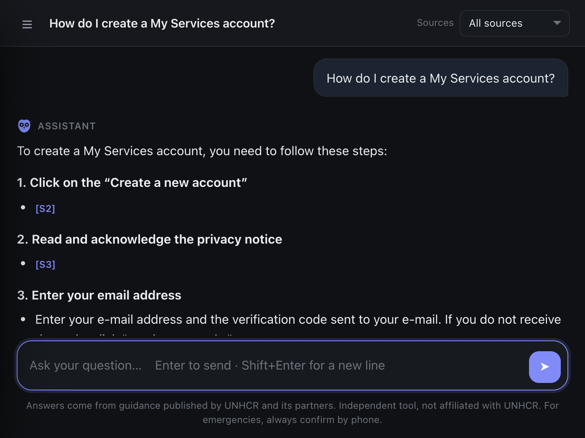
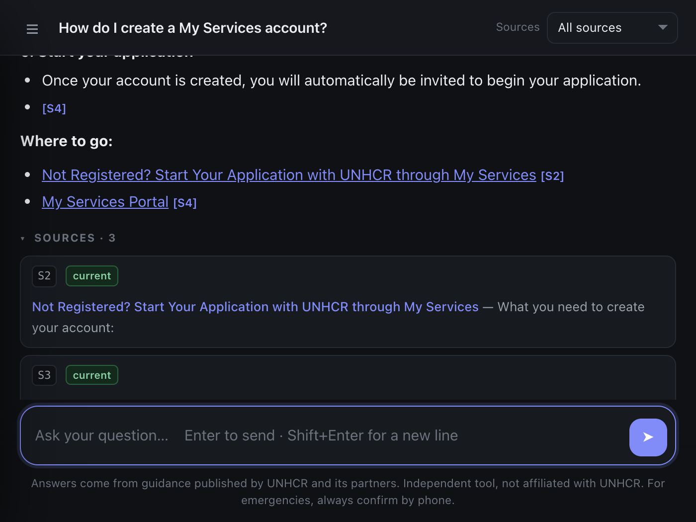

# Päkpätät

*It answers what it knows. It says so when it doesn't.*

An offline assistant that answers refugee-support questions from UNHCR's
published guidance — every answer cited, and every phone number, fee and date
checked against the source text in code before it is shown. **Independent
tool, not affiliated with UNHCR.** The repository ships **code only, no
archive content** — see [Notices](#notices).

Written **Päkpätät**; in identifiers where diacritics do not survive —
package, CLI, environment variables — it is `pakpatat`. The two diaereses are
letters: do not drop them anywhere they will render.


Ask in English or Burmese and get a written answer with inline citations,
composed on the machine itself by a local model. No question leaves the
computer unless you deliberately switch to a cloud provider in Settings, and
the app states on screen which mode it is in.





## What it does

- **Plain questions, English or Burmese**, with follow-ups rewritten into
  standalone search queries.
- **Honest refusal** — below the relevance gate the model is never called;
  "that is not in the archive" is returned instead of a guess.
- **Inline `[S#]` citations**, each verified in code; invented ones are
  stripped and the answer is flagged.
- **Fact verification** — every phone number, email, fee and date must appear
  verbatim in the sources, Burmese numerals included, or it is flagged.
- **Currency labels** — sources marked *current*, *earlier* or *superseded*,
  so a retired page is never quoted as though it were live.
- **Directory lookups** — the NGO clinic directory by town, name or service.
- **Save an answer as an image** — a card for WhatsApp or Telegram carrying
  the answer, its warnings and its sources.
- **Self-updating archive** — crawl from a button, review any changed phone
  number, fee or email, then apply; nothing changes until a human presses
  Apply, and a rollback copy is kept.
- **Fully offline after install** — native window on Windows, macOS and
  Linux; no Electron, no telemetry, no account.
- **MCP server** — `search_archive`, `ask_archive` and `archive_stats` for
  use from an AI client.

## How it works

```
retrieve ──▶ guard ──┬──▶ generate ──▶ verify ──▶ answer
                     └──▶ refuse
```

Three of the four safety layers are plain code the model cannot talk its way
past: the refusal gate (below `MIN_SCORE` the model is never called), citation
verification (every `[S#]` checked against what was actually retrieved), and
fact verification (numbers, emails, fees and dates must match the sources
verbatim). The fourth is grounding: the model sees only retrieved archive
text. Retrieval is hybrid and fully offline — a multilingual ONNX embedding
model plus BM25, fused by reciprocal rank — and is held to a gold set of real
questions paired with the exact fact each must surface:

```bash
python eval/eval_retrieval.py                                # run the gold set
python eval/eval_retrieval.py --compare eval/baseline.json   # exits 1 on regression
```

Run that before and after any change to chunking, embeddings, fusion or
`TOP_K` — it has already caught a change that looked like a clear improvement
but silently dropped recall from 90% to 80%.

## Install

**Windows / macOS, one download.** Get the installer or `.dmg` from
[Releases](../../releases). Per-user install, no administrator password; the
macOS app is unsigned, so right-click → **Open**, once. Neither download
contains archive content. Offline answers need
[Ollama](https://ollama.com/download) plus `ollama pull qwen2.5:3b-instruct`
(~2 GB) — the first-run screen checks what is missing and offers a button for
everything it can fix itself.

**From a checkout.** Install Python 3.11+ and Ollama, then double-click
`scripts/start-macos.command` or `scripts/start-windows.bat` — or by hand:

```bash
python3 -m venv .venv && source .venv/bin/activate
pip install -r requirements.txt
ollama pull qwen2.5:3b-instruct
python app.py            # desktop window
python mcp_server.py     # MCP server
```

Rough requirements: 8 GB RAM and 3 GB free disk for offline use (4 GB RAM
with a cloud provider); macOS 11+, Windows 10+, or Linux from a checkout. To
build the installers yourself see `packaging/` and `.github/workflows/` —
pushing a tag `v<version>` matching `pakpatat/__init__.py` cuts a release in
CI.

## Build your archive

The repository ships no content and fetches nothing during clone or build.
Point it at an archive you hold:

```bash
export PAKPATAT_ARCHIVE=~/path/to/your/archive
python pipeline/build_corpus.py     # archive -> data/corpus.jsonl
python build_index.py               # corpus  -> data/index/
```

Any archive of markdown pages works — the pipeline is not specific to one
source.

An installed copy can also fetch the live site for itself: the **Knowledge
base** panel crawls `help.unhcr.org` from a button — politely, enforced in
code (`pakpatat/scrape.py`): robots.txt obeyed and failing closed, a rate
limit with jitter, conditional requests, backoff honouring `Retry-After`, and
a hard per-run request budget. Updates go through check → review → apply,
with any changed phone number, fee or email reported before a human applies
them. `pipeline/refresh.py` runs the same steps from a terminal, and
`scripts/install-schedule.command` adds an opt-in nightly check that stages
but never publishes.

`scripts/make-archive-bundle.command` packages the un-crawlable half of an
archive (a retired site capture, partner materials) for another machine over
a private, credentialed link — the script itself explains what it includes
and why. Do not put a bundle anywhere public: the contents are UNHCR's
copyrighted work.

## Configuration

All optional — the defaults are the tuned values (see the comments in
`pakpatat/config.py` before changing them):

| variable | default | |
|---|---|---|
| `PAKPATAT_ARCHIVE` | — | source archive (corpus builder and refresh only) |
| `PAKPATAT_DATA` | `./data` | where corpus and index live |
| `ASSISTANT_MODEL_PROVIDER` | `ollama` | `ollama`, `google_genai`, `anthropic`, `openai` |
| `ASSISTANT_MODEL` | `qwen2.5:3b-instruct` | see `pakpatat/config.py` before changing |
| `ASSISTANT_TOP_K` | `8` | chunks per prompt |
| `ASSISTANT_MIN_SCORE` | `0.28` | refusal gate |
| `ASSISTANT_NUM_CTX` | `8192` | Ollama truncates silently at its 4096 default |

API keys go in `.env` (git-ignored) via the in-app Settings panel. Never
commit one.

## Languages

The interface is English and Burmese, and questions can be typed in either.
Interface translation and free-text retrieval are different problems — do not
promise a language without measuring it first;
[i18n/README.md](i18n/README.md) has the method and the numbers.

## Contributing

Two rules beyond the usual:

1. **Never add a suggested question to the in-app guide without running it
   through the retriever first.** Suggesting a question the archive cannot
   answer teaches people the tool is useless exactly when they need it.
2. **A retrieval change is not done until `--compare` passes.** Check that
   the *fact* is in the window, not just that the score went up.

Every source file opens with an SPDX licence line and a shared copyright
line; keep them if you lift a file out of the tree. Git history is the
authorship record — you are not required to add your name anywhere to
contribute.

## Notices

- **Not affiliated with UNHCR.** This is an independent tool, not endorsed
  by, affiliated with, or operated by UNHCR or any UN body. Do not present it
  as an official UNHCR service, and do not use UNHCR's name, logo or brand
  colour as if it were.
- **Content is © UNHCR or its partners.** This repository ships code only:
  `data/` is git-ignored, and the history contains no archive content, no
  `.env` and no `*.jsonl`. Fetching pages for your own offline use is not the
  same act as republishing them — ask UNHCR before distributing content, and
  keep the polite-crawling guarantees in `pakpatat/scrape.py` intact if you
  fork.
- **Not legal or immigration advice.** It is an information-retrieval aid: it
  refuses rather than guesses when the archive does not cover a question, and
  it flags answers drawn from retired pages. Keep both behaviours.
- **No personal data.** The corpus holds published organisational contact
  details only. Never extend it with case files, client records or anything
  identifying an individual — nothing here is designed or audited for that,
  and the app stores conversation history in plain `localStorage`.
- **Takedown.** If anything here is a problem for a rights holder, contact
  the operating organisation and it will be removed on request.

Built by **Hung Om** for the community workers of one refugee
community-based organisation, and published under the MIT licence in case it
is useful to anyone in the same position.

## Licence

Code: [MIT](LICENSE). Archive content: not covered, not included — see
[Notices](#notices).
